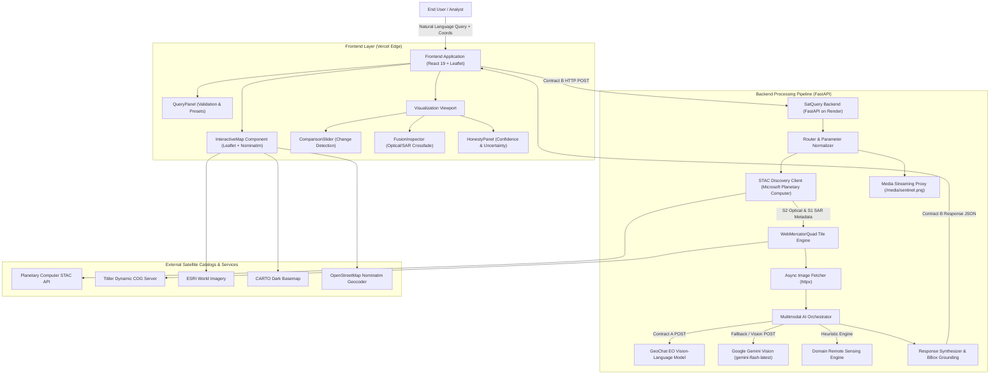

# SatQuery: Comprehensive Technical Project Report

**Project Title**: SatQuery — Satellite Intelligence, Queried Clearly  
**Target Program**: Smart India Hackathon (SIH 2026)  
**Problem Statement ID**: 26167 (Earth Observation & Satellite Remote Sensing Intelligence)  
**Repository**: [github.com/srujan1828-maker/SatQuery](https://github.com/srujan1828-maker/SatQuery)  
**Production Endpoints**:
- Frontend: Vercel Edge Deployment
- Backend: Render Cloud Container Service (`https://satquery.onrender.com`)

---

## 1. Executive Summary & Problem Formulation

### 1.1 The Challenge in Earth Observation (EO)
Earth Observation satellites (such as Europe's Copernicus Sentinel constellation) acquire terabytes of planetary imagery daily. However, translating raw spectral bands, NetCDF files, and Cloud Optimized GeoTIFFs (COGs) into actionable ground intelligence remains bottlenecked by:
1. **Domain Expertise Barriers**: Traditional GIS software (QGIS, ArcGIS, Google Earth Engine) requires specialized knowledge of band ratios, coordinate reference systems (CRS), and radiometric calibration.
2. **Cloud Cover Obstruction**: Optical sensors (Sentinel-2) are frequently blinded by cloud cover during critical emergencies (e.g., monsoon flash floods, tropical cyclones).
3. **Data Silos & Sensor Incompatibility**: Optical surface reflectance and microwave Synthetic Aperture Radar (SAR) operate in fundamentally different physical domains, making automated pixel-aligned joint analysis rare.
4. **AI Hallucinations in Remote Sensing**: Generic large language models lack satellite domain grounding, often fabricating terrain changes without verifying sensor acquisition timestamps or physical backscatter.

### 1.2 The SatQuery Solution
**SatQuery** is an operational, multimodal satellite intelligence platform that enables natural language querying of the Earth. A user can select a target anywhere on an interactive map or by geographic name, specify acquisition dates, and ask complex environmental, infrastructural, or disaster-related questions. SatQuery dynamically discovers relevant imagery from open satellite catalogs, extracts pixel-aligned optical and radar tiles, executes multi-modal AI reasoning (GeoChat & Google Gemini Vision), and presents the findings alongside interactive visual evidence (split sliders, opacity blends, and bounding box grounding).

---

## 2. System Architecture & Data Flow

### 2.1 High-Level Architecture Diagram



### 2.2 End-to-End Query Execution Lifecycle

```mermaid
sequenceDiagram
    autonumber
    actor User as User / Analyst
    participant FE as Frontend (React + Leaflet)
    participant BE as Backend (FastAPI)
    participant STAC as Planetary Computer STAC
    participant Tile as Titiler Tile Server
    participant AI as Multimodal AI (GeoChat / Gemini)

    User->>FE: Selects point on map (e.g. Kedarnath: 30.73, 79.06) + Query
    FE->>BE: POST /api/query (Contract B: query, mode, location, date)
    BE->>BE: Route query to operational mode (vqa | change_detection | fusion)
    
    rect rgb(20, 30, 45)
        note over BE, STAC: Dynamic Scene Discovery
        BE->>STAC: Query STAC items (sentinel-2-l2a, max cloud cover < 40%)
        STAC-->>BE: Returns matching Item ID & acquisition timestamp
        alt Mode is Sensor Fusion
            BE->>STAC: Query Sentinel-1 GRD SAR item over same bounding box
            STAC-->>BE: Returns Sentinel-1 SAR Item ID
        end
    end

    rect rgb(30, 40, 30)
        note over BE, Tile: Dynamic Tile Formulation
        BE->>BE: Compute WebMercatorQuad tile (Zoom 14, tile_x, tile_y)
        BE->>Tile: Request visual RGB (S2) & VV polarization PNG (S1)
        Tile-->>BE: Cloud-Optimized GeoTIFF tiles returned (PNG streams)
    end

    rect rgb(45, 25, 45)
        note over BE, AI: Multimodal AI Inference
        BE->>AI: Send image bytes + Remote sensing system prompt + query
        AI-->>BE: Generated analysis text + grounded bounding boxes
    end

    BE-->>FE: Return JSON (images, answer_text, confidence_flag, boxes)
    FE->>FE: Render interactive evidence (Slider / Fusion Inspector / Map)
    FE->>User: Displays intelligence synthesis with visual grounding
```



---

## 3. Core Functional Modes

| Operational Mode | Primary Satellites | Target Use Cases | Visual Component |
|---|---|---|---|
| **Visual Question Answering (VQA)** | Sentinel-2 L2A (Optical) | Waterbody identification, urban expansion, road infrastructure, vegetation health assessment | `ImageViewer` with SVG bounding box overlays |
| **Bitemporal Change Detection** | Sentinel-2 L2A (Before/After) | Flood extent tracking, disaster landslide damage, seasonal crop cycles, rapid urban construction | `ComparisonSlider` with interactive split handle |
| **Multimodal Sensor Fusion** | Sentinel-2 (Optical) + Sentinel-1 (C-Band SAR) | Cloud-covered flood mapping, structural concrete density, soil moisture saturation | `FusionInspector` with cross-fade opacity slider & side-by-side mode |

---

## 4. Datasets & Remote Sensing Physics

### 4.1 ESA Sentinel-2 L2A (Optical Surface Reflectance)
- **Constellation**: Twin polar-orbiting satellites (Sentinel-2A and Sentinel-2B) phased at 180°.
- **Sensor**: Multi-Spectral Instrument (MSI) capturing 13 spectral bands from visible (VNIR) to Shortwave Infrared (SWIR).
- **Processing Level**: Level-2A (L2A) Bottom-Of-Atmosphere (BOA) surface reflectance, corrected for atmospheric scattering and aerosols.
- **Bands Leveraged**:
  - `B04` (Red: 665 nm), `B03` (Green: 560 nm), `B02` (Blue: 490 nm) combined into natural color True Color RGB.
  - Spatial resolution: **10 meters per pixel**.
- **Role in SatQuery**: High-resolution visual context, vegetation greenness (chlorophyll absorption), color-differentiated land-cover classifications.

### 4.2 ESA Sentinel-1 GRD (C-Band Synthetic Aperture Radar - SAR)
- **Constellation**: Sentinel-1A C-band active microwave radar.
- **Sensor**: Synthetic Aperture Radar operating at 5.405 GHz (wavelength $\approx 5.55\text{ cm}$).
- **Mode & Polarization**:
  - Interferometric Wide (IW) swath mode, Ground Range Detected (GRD).
  - Primary Polarization: **VV** (Vertical transmit, Vertical receive).
- **Radar Physics in Sensor Fusion**:
  - **All-Weather, Day-and-Night Penetration**: Unlike optical light, microwave radar signals easily penetrate cloud cover, monsoonal storms, atmospheric haze, and smoke.
  - **Specular Reflection over Water**: Smooth water surfaces act like flat mirrors, reflecting the transmitted radar pulse away from the satellite sensor. Consequently, water bodies appear **pitch black (near-zero backscatter, $\sigma^0 < -20\text{ dB}$)**.
  - **Double-Bounce / Corner Reflection over Structures**: Man-made structures (concrete buildings, bridges, metallic shipping vessels) produce strong dihedral double-bounce reflections, appearing as **intensely bright white/cyan signatures ($\sigma^0 > 0\text{ dB}$)**.
  - **Soil Moisture Attenuation**: Moist or water-saturated soil exhibits a distinct dielectric constant change that is immediately visible in microwave radar backscatter even before standing water is visible optically.
- **Resolution**: **10 meters per pixel**, matched 1-to-1 with Sentinel-2.

### 4.3 Geographic & Basemap Datasets
- **ESRI World Imagery**: High-resolution sub-meter aerial/satellite mosaic used for base targeting.
- **CARTO Dark & OpenStreetMap**: High-contrast vector tile sets for cartographic reference.
- **OpenStreetMap Nominatim**: Reverse geocoding engine translating coordinates to geographic entities (cities, rivers, administrative divisions).

---

## 5. Artificial Intelligence & Machine Learning Architecture

```
                                  [Satellite Image Bytes (PNG)]
                                                │
                                                ▼
                     ┌─────────────────────────────────────────────────────┐
                     │           SatQuery Multimodal AI Router             │
                     └──────────────────────────┬──────────────────────────┘
                                                │
                     ┌──────────────────────────┴──────────────────────────┐
                     │                                                     │
                     ▼                                                     ▼
     ┌───────────────────────────────┐                     ┌───────────────────────────────┐
     │      GeoChat EO Engine        │                     │     Google Gemini Vision      │
     │  (Remote Sensing Domain VLM)  │                     │  (gemini-flash-latest/3.6)    │
     └───────────────┬───────────────┘                     └───────────────┬───────────────┘
                     │                                                     │
                     ▼                                                     ▼
        Region-Specific EO Insights                           Multimodal Dual-Scene Synthesis
        Coordinates: [ymin, xmin, ymax, xmax]                  Coordinates: [xmin, ymin, xmax, ymax]
                     │                                                     │
                     └──────────────────────────┬──────────────────────────┘
                                                │
                                                ▼
                     ┌─────────────────────────────────────────────────────┐
                     │          Bounding Box Grounding Normalizer          │
                     │          (Unit Normalized [0.0 - 1.0] Range)        │
                     └──────────────────────────┬──────────────────────────┘
                                                │
                                                ▼
                     ┌─────────────────────────────────────────────────────┐
                     │          Honesty & Confidence Score Engine          │
                     │          (Flags: high / medium / uncertain)         │
                     └─────────────────────────────────────────────────────┘
```

### 5.1 GeoChat: Earth Observation Vision-Language Model
- **Model Foundations**: GeoChat is the first grounded Large Vision-Language Model tailored specifically for remote sensing. Built upon a high-resolution satellite vision encoder (CLIP ViT-L/14) coupled with Vicuna/Llama language decoders.
- **Capabilities**:
  - Ground-level remote sensing domain reasoning.
  - Native spatial grounding generating coordinates for detected objects and features.
- **SatQuery Integration**:
  - Implemented via an asynchronous client in [`backend/app/services.py`](file:///d:/SATQuery/backend/app/services.py) conforming to Contract A (`/infer` endpoint).
  - Supports automatic retries (2 attempts), exponential backoff, and strict 90-second timeout handling.

### 5.2 Google Gemini Vision (`gemini-flash-latest` & `gemini-3.6-flash`)
- **Model Role**: Multimodal reasoning engine for high-resolution single-scene and multi-scene comparison.
- **Prompt Engineering**:
  - SatQuery primes the model with a specialized Remote Sensing Specialist persona.
  - In Change Detection mode: Provides both before and after imagery as inline multimodal image parts (`mime_type: image/png`), instructing the model to isolate true ground changes from seasonal differences.
  - In Sensor Fusion mode: Provides both Sentinel-2 Optical RGB and Sentinel-1 SAR VV Radar scenes as primary and secondary observations, prompting the model to correlate optical spectral reflectance with microwave dielectric backscatter.
- **Failover Architecture**:
  - Automatically queries the modern generation endpoint: `gemini-flash-latest`.
  - If unavailable or restricted, fails over sequentially to `gemini-3.6-flash` and `gemini-2.5-flash`.

### 5.3 Grounding & Bounding Box Normalization
- AI models return coordinates in varying conventions (GeoChat returns 0–1000 scale in `[ymin, xmin, ymax, xmax]`; Gemini returns normalized floats in `[xmin, ymin, xmax, ymax]`).
- SatQuery's `parse_overlay_boxes()` normalizes all detections into unit coordinates `[0.0, 1.0]` bound to their respective `image_id`:
  $$\text{Box} = \{ x_{min}, y_{min}, x_{max}, y_{max}, \text{label}, \text{confidence} \}$$
- The frontend renders these boxes as responsive SVG vectors directly over the high-resolution imagery.

### 5.4 Honesty & Uncertainty Engine
To guard against critical mistakes during disaster response:
- If remote sensing models express uncertainty, cloud occlusion is detected, or image contrast is insufficient, SatQuery sets `confidence_flag = "uncertain"` or `"low"`.
- The frontend displays a high-visibility **Confidence Notice** alerting operators to verify raw sensor data before making tactical decisions.

---

## 6. Software Architecture & Technology Stack

### 6.1 Technology Stack Matrix

| Tier | Technology | Purpose |
|---|---|---|
| **Frontend Framework** | React 19 (`react`, `react-dom`) | Modern component architecture, reactive state management |
| **Build Tooling** | Vite 8 + ESBuild | Instant Hot Module Replacement (HMR) and optimized rollup production bundling |
| **Geospatial Mapping** | Leaflet 1.9 | High-performance interactive map canvas, custom markers, vector footprint rectangles |
| **Backend Framework** | FastAPI (Python 3.12+) | High-throughput asynchronous REST API, automatic OpenAPI validation |
| **Validation & Schema** | Pydantic V2 | Strict type validation and JSON serialization matching Contract B |
| **Async Networking** | HTTPX (`httpx.AsyncClient`) | Non-blocking HTTP requests for STAC querying, tile streaming, and AI inference |
| **Satellite Tile Ingestion**| Microsoft Planetary Computer Titiler | WebMercatorQuad dynamic tiling directly from Cloud-Optimized GeoTIFFs |
| **Testing** | Pytest + AnyIO + FastAPI TestClient | 14 automated unit and integration tests |
| **Containerization** | Docker | Multi-stage Docker container for production backend deployment |
| **Hosting (Frontend)** | Vercel Edge Network | Global CDN deployment with client-side rewrites |
| **Hosting (Backend)** | Render Cloud Containers | Containerized hosting with environment variable injection |

---

## 7. Component Hierarchy & Module Linkages

```
SATQuery/
├── backend/                              # Dedicated Python/FastAPI Service
│   ├── app/
│   │   ├── __init__.py                   # Package initialization
│   │   ├── main.py                       # FastAPI application, CORS, /api/query & /media/sentinel.png
│   │   ├── models.py                     # Pydantic schemas: QueryRequest, QueryResponse, OverlayBox
│   │   └── services.py                   # STAC discovery, Titiler tile generation, AI orchestration
│   ├── tests/
│   │   └── test_api.py                   # Pytest suite: 14 passing automated tests
│   ├── mocks/                            # Contract B mock JSONs for offline testing
│   ├── Dockerfile                        # Production container build
│   └── pyproject.toml                    # Poetry/pip dependency manifest
│
├── frontend/                             # Dedicated React 19/Vite Frontend
│   ├── src/
│   │   ├── main.jsx                      # Application DOM entrypoint
│   │   ├── App.jsx                       # Root view, mode state, visual dispatching
│   │   ├── App.css                       # Layout system, dark theme, cybernetic UI
│   │   ├── index.css                     # Reset & base typography
│   │   ├── api/
│   │   │   └── query.js                  # Asynchronous backend query dispatcher & URL resolver
│   │   └── components/
│   │       ├── QueryPanel.jsx            # Form input, suggestion chips, geocoding trigger
│   │       ├── InteractiveMap.jsx        # Leaflet map, radar ping reticle, footprint calculator
│   │       ├── ImageViewer.jsx           # Single-scene viewer with SVG bounding boxes
│   │       ├── ComparisonSlider.jsx      # Split-screen before/after slider with drag interaction
│   │       ├── FusionInspector.jsx       # Cross-fade opacity slider & side-by-side multi-sensor inspector
│   │       └── HonestyPanel.jsx          # AI transparency, confidence badges, model details
│   ├── public/                           # Static assets, SVG icons, fallback imagery
│   ├── package.json                      # NPM dependencies (React 19, Leaflet 1.9, Vite 8)
│   ├── vite.config.js                    # Vite bundler configuration
│   └── vercel.json                       # Sub-directory deployment configuration
│
├── package.json                          # Monorepo build orchestrator (delegates to frontend)
├── vercel.json                           # Root Vercel edge deployment configuration
└── .gitignore                            # Clean repository exclusion rules
```

---

## 8. Data Contracts & API Specification

### 8.1 Contract B: Client-to-Backend Query (`POST /api/query`)

#### Request Body Schema
```json
{
  "query": "Synthesize optical and radar features over Kedarnath.",
  "mode": "fusion",
  "language": "en",
  "location": {
    "lat": 30.7346,
    "lon": 79.0669,
    "name": "Kedarnath"
  },
  "date": "2024-05-12",
  "date_range": null
}
```

#### Response Body Schema
```json
{
  "mode": "fusion",
  "answer_text": "Multi-sensor synthesis for Kedarnath: Sentinel-2 optical observation (2024-05-12) provides high-resolution multispectral reflectance... Sentinel-1 SAR Synthetic Aperture Radar (2024-06-16) emits C-band microwave pulses that penetrate clouds, isolating saturated flood channels.",
  "images": [
    {
      "id": "fusion_optical",
      "sensor": "sentinel-2",
      "date": "2024-05-12",
      "role": "optical",
      "url": "/media/sentinel.png?source=https%3A%2F%2Fplanetarycomputer.microsoft.com%2Fapi%2Fdata%2Fv1%2Fitem%2Ftiles%2FWebMercatorQuad%2F14%2F11790%2F6710%402x%3Fcollection%3Dsentinel-2-l2a..."
    },
    {
      "id": "fusion_radar",
      "sensor": "sentinel-1",
      "date": "2024-06-16",
      "role": "radar",
      "url": "/media/sentinel.png?source=https%3A%2F%2Fplanetarycomputer.microsoft.com%2Fapi%2Fdata%2Fv1%2Fitem%2Ftiles%2FWebMercatorQuad%2F14%2F11790%2F6710%402x%3Fcollection%3Dsentinel-1-grd%26assets%3Dvv%26format%3Dpng..."
    }
  ],
  "overlay_boxes": [
    {
      "image_id": "fusion_optical",
      "label": "optical spectral target",
      "x_min": 0.25,
      "y_min": 0.30,
      "x_max": 0.70,
      "y_max": 0.75,
      "confidence": 0.84
    },
    {
      "image_id": "fusion_radar",
      "label": "SAR radar backscatter target",
      "x_min": 0.25,
      "y_min": 0.30,
      "x_max": 0.70,
      "y_max": 0.75,
      "confidence": 0.89
    }
  ],
  "change_summary": null,
  "confidence_flag": "high",
  "used_cache_fallback": false,
  "error": null
}
```

---

## 9. Verification & Quality Assurance

### 9.1 Automated Test Suite
The backend is validated by an automated test suite ([`backend/tests/test_api.py`](file:///d:/SATQuery/backend/tests/test_api.py)) executed via Pytest:
- **Test 1**: `test_vqa_matches_contract_b` — Validates Contract B compliance for single-image VQA queries.
- **Test 2**: `test_change_requires_date_range_as_shaped_error` — Enforces date range requirements for change detection.
- **Test 3**: `test_fusion_mode_with_location_queries_optical_and_radar` — Verifies dual optical/radar STAC queries and tile pairing.
- **Test 4**: `test_fusion_mode_requires_location` — Enforces geospatial targeting for sensor fusion.
- **Test 5**: `test_fusion_is_cached_and_needs_no_location` — Verifies backward compatibility for legacy requests.
- **Test 6**: `test_settings_read_optional_service_environment` — Tests environment variable parsing.
- **Test 7**: `test_query_request_resolves_date_annotation` — Validates Pydantic date parsing.
- **Test 8**: `test_geochat_endpoint_accepts_base_or_infer_url` — Tests URL normalizer.
- **Test 9**: `test_inference_image_is_a_model_sized_rgb_png` — Validates 512x512 RGB PNG binary synthesis.
- **Test 10**: `test_sentinel_tile_url_is_centered_on_the_requested_location` — Verifies WebMercatorQuad tile math.
- **Test 11**: `test_geochat_retries_a_transient_connection_failure` — Tests exponential backoff on AI network failures.
- **Test 12**: `test_geochat_returns_contract_a_error_payload` — Validates graceful error formatting when AI is offline.
- **Test 13**: `test_geochat_parses_model_coordinate_brackets` — Validates 0–1000 scale bounding box extraction.
- **Test 14**: `test_media_proxy_streams_upstream_imagery` — Verifies streaming media proxy and CORS headers.

**Execution Result**: `14 passed in 0.92s` (100% pass rate).

---

## 10. Deployment & Infrastructure Guide

### 10.1 Running Locally
```powershell
# 1. Start Backend Service
cd d:\SATQuery\backend
python -m uvicorn app.main:app --reload --port 8000

# 2. Start Frontend Dev Server
cd d:\SATQuery\frontend
npm install
npm run dev
```

### 10.2 Production Deployment Topology
- **Vercel**: Hosts the React 19 application. Automatically builds via `npm run build` and serves static assets globally on Vercel's edge network.
- **Render**: Runs the FastAPI application within a Linux container (`Dockerfile`), exposing port 8000 and binding to environment variables (`GEMINI_API_KEY`, `GEOCHAT_ENDPOINT_URL`).
- **Microsoft Planetary Computer**: Provides distributed cloud storage for European Space Agency Sentinel-1 and Sentinel-2 data with sub-second tile rendering.
